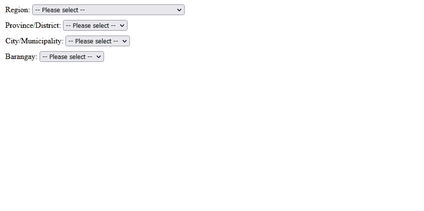

# PSGC JS

A collection of philippine geographic data based on PSGC

## Latest Update

As of **2Q 2021**

## Features

- Collection of geographic data
  - Barangay
  - City
  - District
  - Municipality
  - Sub Municipality
  - Province
  - Region

- Other information such as:
  - Old names (if available)
  - Income Classification
  - Urban / Rural (based on 2015 population)
  - Population (2020)



## Installation

Install psgs-js with npm

```bash
  npm install @ageesea/psgc-js
```

Or via CDN

```html
<script src="https://cdn.jsdelivr.net/npm/@ageesea/psgc-js@latest"></script>
```

## Usage

Create your html markup.

```html
  <!-- sample.html  -->
  <body>
    <select id="regions"></select>
    <select id="provinces"></select>
    <select id="municipality"></select>
    <select id="barangay"></select>
  </body>
```

Then initialize the object by passing the handler to _init_ function.

```js
  import PSGC from '@ageesea/psgc-js'

  PSGC.init({
      bind: {
          region: "#regions",
          province: "#provinces",
          municipality: "#municipality",
          barangay: "#barangay",
      }
  })
```

```js
// required options
{
  bind: {
    region: "id or class",
    province: "id or class",
    municipality: "id or class",
    barangay: "id or class",
  }
}
```

## Available Methods

### PSGC.getAllRegions()

A method that returns all regions in the Philippines

```js
// example.js
import PSGC from '@ageesea/psgc-js'

const allRegions = PSGC.getAllRegions()
```

Output:

```obj
[
  {
    code: 100000000,
    name: 'Region X (Northern Mindanao)',
    geographic_level: 'Reg',
    population_2015: 4689302,
    population_2020: 5022768
  },
  {
    code: 110000000,
    name: 'Region XI (Davao Region)',
    geographic_level: 'Reg',
    population_2015: 4893318,
    population_2020: 5243536
  },
  ...
]
```

### PSGC.get(region, filters)

<table>
  <tr>
    <th>Parameter</th>
    <th>Description</th>
  </tr>
  <tr>
    <td> region </td>
    <td> Region code (refer to <a href="#region-code-reference">Region Code Reference</a>
    </td>
  </tr>
  <tr>
    <td> filters </td>
    <td>
      A filter object
      <pre language='js'>
{
  // available values: <i>Prov, Dist, Mun, SubMun and Bgy</i>
  geographic_level: "value"
  search: {
    code: "geo code",
    type: 'value'
  }
}
      </pre>
    </td>
  </tr>
</table>

```js
// example.js
import PSGC from '@ageesea/psgc-js'

// to get all of the region V provinces
const output = PSGC.get("05", {
  geographic_level: "Prov"
})

// To get the municipality from a particular province, supply the search option
const output = PSGC.get("05", {
  search: {
    code: "056200000", // the geo code of the province. e.g. Sorsogon
    type: 'Mun' // same as the previously mentioned values
  }
})

```

Sample Output:

```obj
[
  {
    code: '051600000',
    name: 'Camarines Norte',
    geographic_level: 'Prov',
    income_classification: '2nd',
    population_2015: 583313,
    population_2020: 629699
  },
  {
    code: '051700000',
    name: 'Camarines Sur',
    geographic_level: 'Prov',
    income_classification: '1st',
    population_2015: 1952544,
    population_2020: 2068244
  },
  ...
]
```

### Region Code Reference

You can all also get the region code by taking the first two digits of the code. Example "050000000" for Bicol, the Region code will be "05"

<table>
<tr>
<th>Code</td>
<th>Region</td>
</tr>
<tr>
<td>01</td>
<td>Region I</td>
</tr>
<tr>
<td>02</td>
<td>Region II</td>
</tr>
<tr>
<td>03</td>
<td>Region III</td>
</tr>
<tr>
<td>04</td>
<td>Region IV-A</td>
</tr>
<tr>
<td>05</td>
<td>Region V</td>
</tr>
<tr>
<td>06</td>
<td>Region VI</td>
</tr>
<tr>
<td>07</td>
<td>Region VII</td>
</tr>
<tr>
<td>08</td>
<td>Region VIII</td>
</tr>
<tr>
<td>09</td>
<td>Region IX</td>
</tr>
<tr>
<td>10</td>
<td>Region X</td>
</tr>
<tr>
<td>11</td>
<td>Region XI</td>
</tr>
<tr>
<td>12</td>
<td>Region XII</td>
</tr>
<tr>
<td>13</td>
<td>NCR</td>
</tr>
<tr>
<td>14</td>
<td>CAR</td>
</tr>
<tr>
<td>15</td>
<td>ARMM</td>
</tr>
<tr>
<td>16</td>
<td>Region XIII</td>
</tr>
<tr>
<td>17</td>
<td>MIMAROPA</td>
</tr>
</table>
